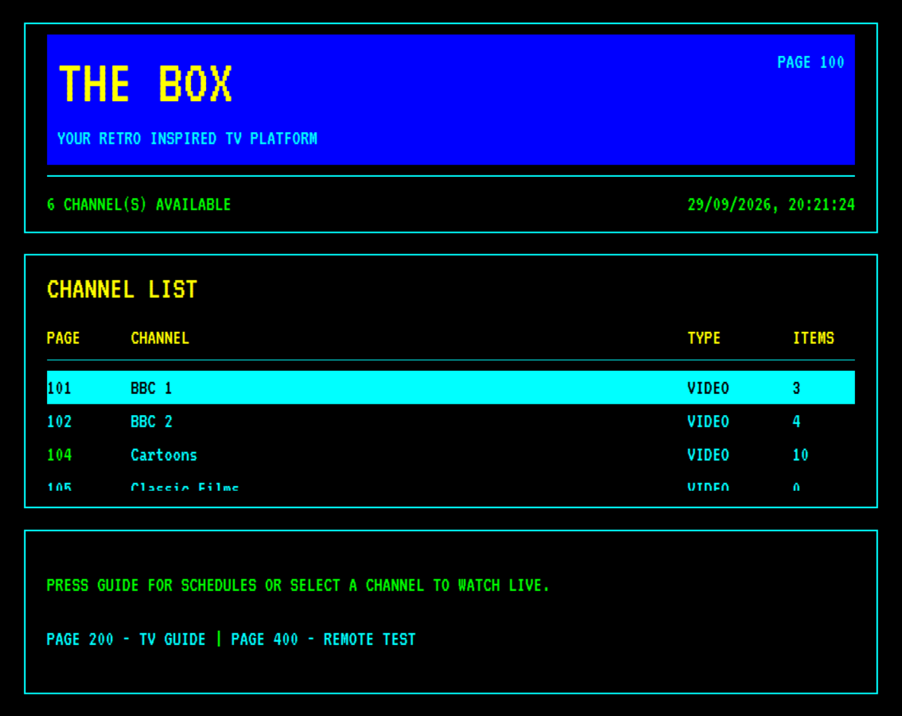

# The Box

The Box is a retro inspired local channel media player with a BBC Ceefax-style interface. Each subfolder under `channels/` becomes a TV channel, and the server builds a random daily schedule from the video files inside.

For installation, configuration, remote control, troubleshooting, and more, see the **[User Guide](userguide.md)**.



## Requirements

- Node.js 18 or newer
- pnpm for installing dependencies (enable with Corepack — see below)
- A bundled **ffprobe** is installed when you run `pnpm install`; **FFmpeg** is optional unless you enable [cached transcode](userguide.md#cached-transcode-optional)

### Enable pnpm

Corepack ships with Node.js 18+. Run once:

```bash
corepack enable
corepack prepare pnpm@latest --activate
```

You can also install system FFmpeg if you prefer:

- **Raspberry Pi / Debian / Ubuntu:** `sudo apt install ffmpeg`
- **macOS:** `brew install ffmpeg`
- **Windows:** install from [ffmpeg.org](https://ffmpeg.org/download.html)

## Quick start

```bash
pnpm install
pnpm start
```

Open [http://localhost:8080](http://localhost:8080).

Admin tools (schedule inspector, **Channels** and transcode lookup in database mode, rescan) live at [http://localhost:8080/admin/](http://localhost:8080/admin/) — separate from the Ceefax viewer. See the [User Guide — Admin tools](userguide.md#admin-tools).

## Configuration

Edit `config.json` (shipped defaults). For machine-specific paths or timezone, add optional **`config.local.json`** in the project root — it is merged on top at startup and is not committed to git. See the [User Guide — Local overrides](userguide.md#local-overrides-configlocaljson).

Example `config.json`:

```json
{
  "channelsRoot": "./channels",
  "host": "0.0.0.0",
  "port": 8080,
  "videoExtensions": [".mp4", ".mkv", ".webm", ".mov", ".avi"],
  "audioExtensions": [".mp3", ".flac", ".ogg", ".m4a", ".wav", ".aac"],
  "scanIntervalMinutes": 60,
  "schedule": {
    "timezone": "Europe/London",
    "seedBy": "day",
    "hoursToGenerate": 24,
    "defaultStartTime": "00:00",
    "defaultEndTime": "24:00"
  },
  "ads": {
    "enabled": false,
    "path": "/absolute/path/to/ads",
    "breakMinAds": 1,
    "breakMaxAds": 3,
    "intervalMinutes": 15,
    "intervalJitterMinutes": 3,
    "programEndGuardMinutes": 5
  },
  "testPattern": {
    "path": ""
  },
  "library": {
    "mode": "filesystem",
    "databasePath": "",
    "startupScan": "if-empty",
    "rescanOnStartup": false
  }
}
```

Set `"adsEnabled": true` in a video channel’s `channel.json` to opt in when global ads are enabled.

For a **SQLite-backed catalogue** (faster restarts, admin channel editor, cached schedules), set `"library.mode": "database"` and `"library.databasePath": "database/thebox.db"` in **`config.local.json`**. See the [User Guide — SQLite catalogue](userguide.md#sqlite-catalogue-database-mode) and [Admin tools](userguide.md#admin-tools).

## Adding channels

1. Create a folder under `channels/`, for example `channels/classic-films/`
2. Add video files to that folder, or set `sourcePath` (one folder) or `sourcePaths` (array) in `channel.json` for external libraries
3. Optionally add `channel.json`:

```json
{
  "displayName": "Classic Films",
  "pageNumber": 101,
  "color": "cyan",
  "sourcePath": "/mnt/media/classic-films",
  "maxContentDuration": 120,
  "identInterval": 1,
  "scanSubfolders": true,
  "schedule": {
    "startTime": "06:00",
    "endTime": "17:00"
  }
}
```

`sourcePath` is optional for a **single** external folder (filenames stay unprefixed). Use **`sourcePaths`** as a JSON array when programmes live in **multiple** folders; each root gets a basename slug prefix (`comedy/…`, `drama/…`) with `-2`, `-3` suffixes if basenames collide. Paths can be absolute or relative to the project folder.

Set `scanSubfolders` to `true` to include videos from subfolders when scanning the channel folder or external source(s).

See the [User Guide — Channel setting reference](userguide.md#channel-setting-reference) for details.

Set `mediaType` to `audio` for audio-only channels. Add artwork (e.g. `artwork.png`) to the channel folder for the watch page display.

`schedule.startTime` and `schedule.endTime` use 24-hour `HH:MM` format in the timezone from `config.json`. New programmes are not started after `endTime`, but the final programme may continue past it. Omit `schedule` to use the global defaults.

4. Restart the server, or call `POST /api/admin/rescan`

## How scheduling works

- Each channel gets a shuffled playlist seeded by `channelId + date`
- The schedule is stable for the whole day
- When you open a channel, playback joins mid-program based on the current time
- By default every channel broadcasts from `00:00` to `24:00` in the configured timezone
- Per-channel `schedule.startTime` / `schedule.endTime` in `channel.json` define when programmes begin and when new ones stop being scheduled
- Channels with less video content repeat programmes more often within their broadcast window; they do not share the same end time unless configured identically

## API

- `GET /api/channels`
- `GET /api/channels/:id`
- `GET /api/channels/:id/schedule`
- `GET /api/channels/:id/now`
- `GET /api/guide`
- `POST /api/admin/rescan`
- `GET /media/:channelId/:filename`

## Raspberry Pi kiosk mode

After starting The Box:

```bash
chromium-browser --kiosk http://localhost:8080
```

For best results on Pi, use H.264 MP4 files at 720p or lower.

## Project layout

```text
TheBox/
├── config.json              # Shipped defaults
│   config.local.json        # Optional overrides (gitignored)
├── channels/
├── public/          # Ceefax-style viewer UI
│   └── admin/       # Modern admin tools (CSS/JS separate from thebox.css)
└── server/          # Express app, scanner, scheduler, streaming
```

## Development

```bash
pnpm dev
```

Uses Node's built-in `--watch` mode for automatic restarts.
